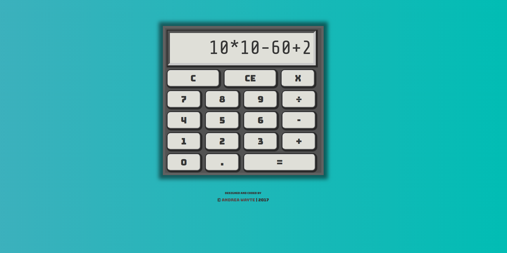

# Calculator
>A basic calculator which computes order of operation equations.

Coming Soon - Live Site

### Technologies
* Javascript, Jquery, HTML5, CSS3

### About
> The calculator is a great way to practice logic flow and objects. I took an agile approach to this project by first incorporating basic addition, subtraction, multiplication and division functions. I created an object for each input which is stored in an array in the Calculator object. When the user clicks the equal sign, the array of input objects is first passed through a filter function to remove any outlier operands. Then the filtered array is passed through a function to perform order of operations. I used an array of operand symbols to achieve this. My future goals for this project is to convert this to React MVC. 